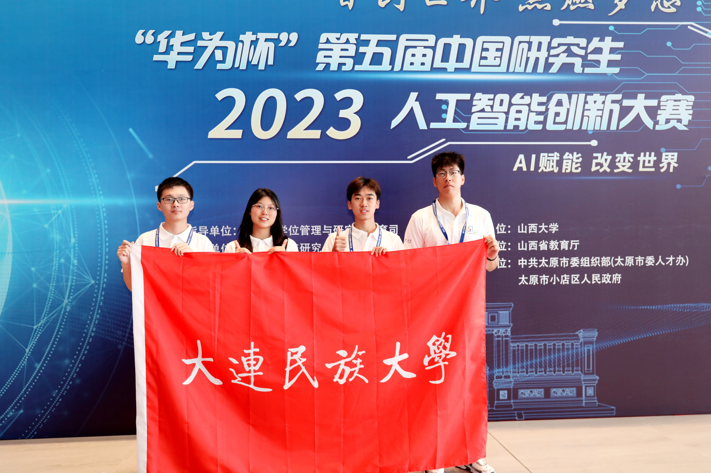



获奖统计
=

| 序号 | 竞赛名称 | 竞赛等级 | 国家级一等奖 | 国家级二等奖 | 国家级三等奖 | 省级一等奖 | 省级二等奖 | 省级三等奖 |
|:--------:|:-------:|:--------:|:--------:|:--------:|:--------:|:--------:|:--------:|:--------:|
| 1 | 中国研究生创新实践系列大赛——中国研究生人工智能创新大赛 | A2 | | 1 | | | | |
| 2 | 中国研究生创新实践系列大赛——中国研究生数学建模竞赛 | A2| | | 1 | | | |
| 3 | 中国大学生计算机设计大赛 | A2 | | | 1 | | 1 | |
| 4 | iCAN创新创业大赛 | A2 | | | | | 1 | |
| 5 | 蓝桥杯全国软件和信息技术专业人才大赛| A2 | | 2 | 3 | 8 | 6 | 13 |
| 6 | 全球校园人工智能算法精英大赛 | A2 | | | | | | 1 |
| 7 | APMCM亚太地区大学生数学建模竞赛 | A3 | 1 | 1 | 2 | | | |
| 8 | 华为ICT大赛 | A2 | | | | 1 | 2 | |

比赛掠影
=

第1页

第2页

